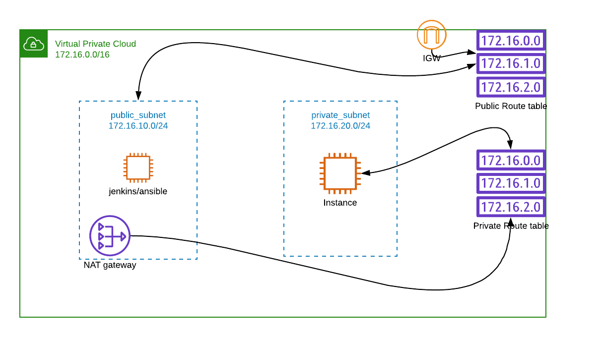

# terraform

## about automation
this automation is focused on creating below aws resources
1. vpc from scratch
2. public and private subnet
3. public and private route table
4. internet gateway and association with public route table
5. create eip, nat gateway and association with private route table
6. create ec2 machine each in both subnet
7. install jenkins and ansible on public_subnet machine.

all files are under terraform/terraform-vpc
